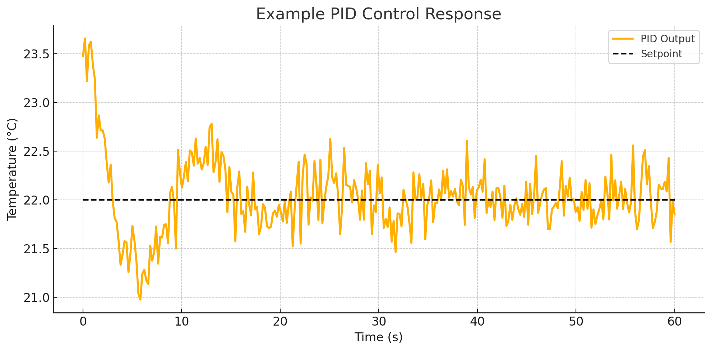

# Simple PID Controller

> The Simple PID Controller is a Home Assistant integration for real-time PID control with UI-based tuning and diagnostics.

> Original codebase: https://github.com/bvweerd/simple_pid_controller. This repository is a copy of the original project.

---

## 📚 Table of Contents
- [Features](#features)
- [Installation](#installation)
  - [HACS (Recommended)](#hacs-recommended)
  - [Manual Installation](#manual-installation)
  - [Removal Instructions](#removal-instructions) 
- [Configuration](#configuration)
- [Customizing the Unit of Measurement](#customizing-the-unit-of-measurement)
- [Entities Overview](#entities-overview)
- [PID Tuning Guide](#pid-tuning-guide)
  - [Manual Tuning](#1-manual-trial--error)
  - [Ziegler–Nichols Method](#2-zieglernichols-method)
- [More details and extended documentation](#extended-documentation)
- [Example PID Graph](#example-pid-graph)
- [Support & Development](#support--development)
- [Service Actions](#service-actions)


---

## ✨ Features

- **Live PID tuning** via Number entities.
- **Diagnostics** for P, I, and D terms (optional).
- **Switch** to toggle auto mode and proportional-on-measurement.
- **Configurable** output limits, setpoint, and sample time.

### Included Entities

| Platform | Entity                    | Purpose                                 |
|----------|---------------------------|-----------------------------------------|
| Sensor   | `PID Output`              | Current controller output as percentage |
| Sensor   | `PID P Contribution`      | Proportional term value (diagnostic)    |
| Sensor   | `PID I Contribution`      | Integral term value (diagnostic)        |
| Sensor   | `PID D Contribution`      | Derivative term value (diagnostic)      |
| Number   | `Kp`, `Ki`, `Kd`          | PID gain parameters                     |
| Number   | `Setpoint`                | Desired target value                    |
| Number   | `Output Min` / `Max`      | Controller output limits                |
| Number   | `Sample Time`             | PID evaluation interval                 |
| Switch   | `Auto Mode`               | Toggle automatic control                |
| Switch   | `Proportional on Measurement` | Change proportional mode         |
| Switch   | `Windup Protection`       | Toggle windup protection                |


> 💡 All entities are editable via the UI in **Settings > Devices & Services > [Your Controller] > Options**.

---

## 🔧 Installation

### HACS (Recommended)

1. In Home Assistant UI, navigate to **HACS > Integrations**
2. Click the three-dot menu (⋮) and select **Custom repositories**
3. Add:
   ```text
   https://github.com/bvweerd/simple_pid_controller
   ```
   Select **Integration** as type
4. Search for **Simple PID Controller** and install
5. Restart Home Assistant

### Manual Installation

1. Download or clone this repository
2. Copy `simple_pid_controller` to `/config/custom_components/`
3. Restart Home Assistant

### Removal Instructions 
To remove the Simple PID Controller, navigate to **Settings > Devices & Services**, select **Simple PID Controller**, and click **Delete**. If installed manually, delete the `custom_components/simple_pid_controller` directory and restart Home Assistant.

---

## ⚙️ Configuration
The controller is configured through the UI using the Config Flow .

1. Go to **Settings > Devices & Services**
2. Click **Add Integration** and choose **Simple PID Controller**
3. Enter:
   - **Name**: e.g., "Heater Controller"
   - **Sensor Entity**: e.g., `sensor.living_room_temperature`
4. Submit and finish setup

**Default Range:**  
The controller’s setpoint range defaults to **0.0 – 100.0**. To customize this range, select the integration in **Settings > Devices & Services**, click **Options**, adjust **Range Min** and **Range Max**, and save.

---

## 🏷️ Customizing the Unit of Measurement

The PID output sensor has no fixed unit of measurement, because the output value depends entirely on your application (e.g. %, °C, A, W). Per Home Assistant architecture, units cannot be configured inside the integration itself — instead, use one of the approaches below.

### Option 1: customize.yaml

Add a device class and unit to the entity directly. This works for the PID output sensor and for number entities such as `Setpoint`.

**`configuration.yaml`**
```yaml
homeassistant:
  customize: !include customize.yaml
```

**`customize.yaml`**
```yaml
sensor.my_pid_controller_pid_output:
  device_class: temperature
  unit_of_measurement: "°C"

number.my_pid_controller_setpoint:
  device_class: temperature
  unit_of_measurement: "°C"
```

> **Note:** Only set `device_class` to a value that matches the physical meaning of the output. Using a wrong device class can affect history graphs and unit conversions.

### Option 2: Template sensor

Use a template sensor to wrap the PID output with any unit and label you need. This is useful when you want a clean, named entity without modifying the raw output entity.

**`configuration.yaml`** (or your `template:` block):
```yaml
template:
  - sensor:
      - name: "Heater setpoint output"
        unit_of_measurement: "°C"
        device_class: temperature
        state_class: measurement
        state: "{{ states('sensor.my_pid_controller_pid_output') | float(0) | round(2) }}"
```

---

## 📊 Entities Overview

| Platform | Entity Suffix                 | Description                                        |
|----------|-------------------------------|----------------------------------------------------|
| Sensor   | `PID Output`                  | Current controller output (%).                     |
| Sensor   | `PID P/I/D Contribution`      | Diagnostic terms. Disabled by default.             |
| Number   | `Kp`, `Ki`, `Kd`              | PID gains.                                         |
| Number   | `Setpoint`                    | Desired system target.                             |
| Number   | `Output Min` / `Output Max`   | Min/max control limits.                            |
| Number   | `Sample Time`                 | PID evaluation rate in seconds.                    |
| Switch   | `Auto Mode`                   | Enable/disable PID automation.                     |
| Switch   | `Proportional on Measurement` | Use measurement instead of error for P term.       |
| Switch   | `Windup Protection`           | Toggle windup protection                           |

---

## 🎯 PID Tuning Guide

A PID controller continuously corrects the difference between a **setpoint** and **measured value** using:

- **P (Proportional)**: reacts to present error
- **I (Integral)**: compensates for past error
- **D (Derivative)**: predicts future error trends

<details>
<summary><strong>1. Manual (Trial & Error)</strong></summary>

1. Set `Ki` and `Kd` to 0
2. Start with small `Kp` (e.g., 1.0)
3. Increase `Kp` until oscillations appear
4. Halve that `Kp` value
5. Increase `Ki` to reduce steady-state error
6. Add `Kd` to smooth out oscillations

</details>

<details>
<summary><strong>2. Ziegler–Nichols Method</strong></summary>

1. Set `Ki = 0`, `Kd = 0`, increase `Kp` until sustained oscillations
2. Measure:
   - **Ku** = critical gain
   - **Pu** = oscillation period
3. Apply:
   - `Kp = 0.6 × Ku`
   - `Ki = 1.2 × Ku / Pu`
   - `Kd = 0.075 × Ku × Pu`

</details>

### Common pitfalls with the I term

Several reported issues stem from the interaction between the **integral term** and the controller's configured limits. Keep the following points in mind when tuning:

- **Integral sensor shows the clamped output** – The integration exposes a diagnostic entity for the I contribution. When `Output Min`/`Output Max` are set, the value you see in the UI is the clamped contribution after limits are applied. This means that with `Ki = 0` the integral value will simply remain at the boundary (e.g. `Output Min = 3` results in `I = 3`). This is expected behaviour and not a sign that the integral is "stuck".
- **Choose a suitable start value** – When the controller is initialised it sets the integral term to the configured start value, but still clamps it within your `Output Min`/`Output Max` range. If you want the controller to begin from `0`, select the **PID Start Value** option `zero_start` (or call the `simple_pid_controller.set_output` service with the `preset` parameter) and temporarily widen the output range if needed. Otherwise the integral will be forced to the lowest allowed value.
- **Ki must be non-zero to change the integral** – Setting `Ki = 0` effectively freezes the integral term. Use a small but non-zero value if you need the controller to move away from the clamp over time. You can combine this with **Windup Protection** (toggle entity) to prevent large overshoots once the setpoint is reached.

If your process requires a non-zero minimum output (for example, EV charging currents that must stay above 6 A), start your tuning with:

1. `PID Start Value = zero_start` so the controller can compute from a neutral baseline.
2. A modest proportional gain (`Kp`) that does not immediately drive the output below the minimum.
3. A small integral gain (`Ki`) to let the controller move away from the clamped value without causing overshoot.

These steps help avoid the "integral stuck at minimum" effect while keeping the controller within the bounds your hardware requires.

---

### How it works in practice

1. **Initialization**  
   - On startup (or when options change), we set up a single `sample_time` value (in seconds).  
   - We register a periodic callback with Home Assistant’s scheduler (`async_track_time_interval` or `DataUpdateCoordinator`) using that same `sample_time`.  

2. **Coordinator Tick**  
   - Every `sample_time` seconds, Home Assistant’s scheduler invokes our update method.  
   - We immediately read the current process variable (e.g. temperature sensor) and pass it to the PID logic.

3. **PID Logic & Output**  
   - The PID algorithm calculates the Proportional, Integral, and Derivative terms and writes the result to your target entity (e.g. a heater or set-point).

4. **Adjusting Sample Time**
   - Changing `sample_time` in your integration options takes effect at the end of the current interval—no Home Assistant restart is required.  
   - On the next tick, the coordinator will use the new interval.

---

## 📚 Extended documentation

The integration is based on simple-pid [https://pypi.org/project/simple-pid/](https://pypi.org/project/simple-pid/)

Read the user guide here: [https://simple-pid.readthedocs.io/en/latest/user_guide.html#user-guide](https://simple-pid.readthedocs.io/en/latest/user_guide.html#user-guide)

---

## 📈 Example PID Graph

Here's an example output showing the controller responding to a setpoint:



---

## 🛠️ Support & Development

- **GitHub Repository**: [https://github.com/bvweerd/simple_pid_controller](https://github.com/bvweerd/simple_pid_controller)
- **Issues & Bugs**: [Report here](https://github.com/bvweerd/simple_pid_controller/issues)

---

## 🔧 Service Actions
The integration provides a `simple_pid_controller.set_output` service to adjust the controller output directly.

### `simple_pid_controller.set_output`
| Field | Description |
|-------|-------------|
| `entity_id` | PID output sensor entity to control (may be provided via `target`) |
| `preset` | Optional preset: `zero_start`, `last_known_value`, or `startup_value` |
| `value` | Optional manual value between configured `Output Min` and `Output Max` |

- When **Auto Mode** is off, the last output value is updated to the chosen value.
- When **Auto Mode** is on, the PID restarts from the new value and the coordinator refreshes.
- Exactly one PID output sensor entity must be targeted.

Example using `target`:

```yaml
service: simple_pid_controller.set_output
target:
  entity_id: sensor.spid_x_pid_output
data:
  value: 200
```

Example using `target`:

```yaml
action: simple_pid_controller.set_output
target:
  entity_id: sensor.spid_x_pid_output
data:
  value: 200
```


